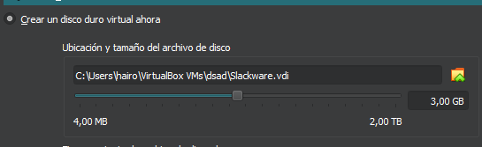
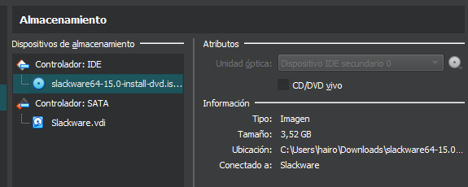

# Instalación-Slackware-Linux
### El primer caso el la configuración del sistema con la carateristicas solicitadas
**700MiB de memoria**

**3.0 GB de almacenamiento**

### El segundo paso es seleccionar la imagen ISO de slackware al DVD virtual

