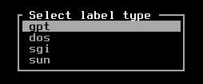
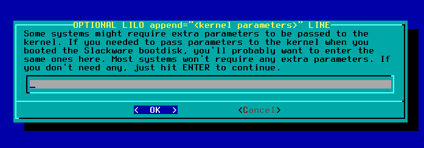
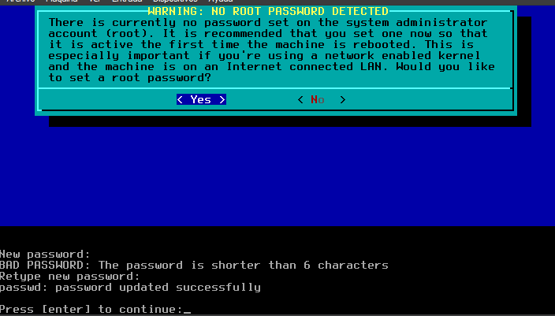

# Instalación-Slackware-Linux
### El primer paso es la configuración del sistema con la carateristicas solicitadas
**- 700MiB de memoria**

**- 3.0 GB de almacenamiento**

### El segundo paso es seleccionar la imagen ISO de slackware al DVD virtual

**- Una vez iniciado se configuramos un idioma para el teclado, en mi caso el idioma español**

**- Se inicia sesion como "root"**

### Para empezar el proceso de particion se usa el comando "cfdisk**

**- Lo que nos da acceso al siguiente menú, donde se selecciona la opcion "dos"**

**- Le damos a agregar una nueva particion:**

**- Elegimos su tamaño en mi caso "1.5G"**

**- Se pone de tipo primario**

**- Cambiamos su tipo a "Linux Swap"**

**-Repetimos el proceso para una nueva particion pero de tipo "Linux"

**-Elegimos "write" para escribir las dos particiones, y aceptamos esta accion con "yes"**

**- Salimos del apartado**

**- Verificamos que se hayan creado las particiones correctamente**

**- Como la primera partiicon no fue detectada correctamente como "Swap", realizamos su activacion**

**- Ahora continuamos iniciando el "setup"

**- En este caso como ya tenemos definido nuestro "keymap" continuamos con "AddSwap", donde nos detecta la primera particion como una posible ubicaion del swap, a lo que aceptaremos**

**- Una vez aceptado nos indica que el "sawp" ya fue configurado**

**- Seleccionamos la particion donde queremos que se instale el sistema**

**-En nuestro caos vamos a sellecionar el "Filesystem" ext4**

**-Seleccionamos la primer opcion de la instalacion**

**- Configuramos lo que queremos que se instale**

**- Elegimos una instalacion guiada, para poder controlar el almacenamiento que vamos a usar**

**- La primer parte debemos instalarla obligatoriamente**

**- Luego de configurar todo lo que queriamos instalado, con aparecesara la siguiente opcion, en nuestro caso le dare "skip"**

**- Instalamos Lilo**

**- Elegimos la forma estandar**

**- En este punto no es necesario poner parametros**

**- En este caso vamos a seleccionar el "mbr" como destino para la instalacion de LILO

**- Elegimos que servicios queremos en el inicio**

**- Configuraciones varias**

**- Configuramos una contraseña para el usuario**

**- Y con esto terminamos la parte del "Setup", ahora reiniciamos**

### El cuarto paso es configurar una tarjeta de red de la siguiente manera:

**- Usando el comando "netconfing", empezamos la configuracion, el primer paso el darle un nombre cualquiera**

**- Al dominio en este caso usamos:**

**- Seleccionamos "static IP"**

**- Ingresamos la ip, cambiando los dos ultimos digitos por el del pc a trabajar, en mi caso "34"**

**- El siguiente número, solo cambiamos el ultimo por un numero entre 60 y 65**

**- En "IPv4 Addresses cambiamos en 24 por 16**

**- Hacemos un reboot**

**- Comprobamos la conexion a su mismo ping**

**- Al intentar comprobar la conexion a google, notamos que fallo, por lo cual se tiene que arreglar nuevamente usando "netconfing", y cambiando donde anteriormente pusimos 60, por 61**

**- Realizamos nuevamente la comprobacion:**

**- Y finalmente comprobamos las conexiones que se nos piden**

**- Para que se guarden los cambios a pesar de reiniciar la maquina entramos a la configuracion de la mascara y agregamos "NETMASK"**

