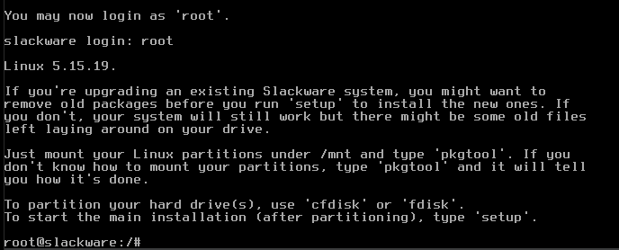

# Instalación-Slackware-Linux
### El primer paso es la configuración del sistema con la carateristicas solicitadas
**- 700MiB de memoria**

**- 3.0 GB de almacenamiento**

### El segundo paso es seleccionar la imagen ISO de slackware al DVD virtual

**- Una vez iniciado se configuramos un idioma para el teclado, en mi caso el idioma español**

**- Se inicia sesion como "root"**

### Para empezar el proceso de particion se usa el comando "cfdisk**

**- Lo que nos da acceso al siguiente menú, donde se selecciona la opcion "dos"**

**- Le damos a agregar una nueva particion:**

**- Elegimos su tamaño en mi caso "1.5G"**

**- Se pone de tipo primario**

**- Cambiamos su tipo a "Linux Swap"**

**-Repetimos el proceso para una nueva particion pero de tipo "Linux"

**-Elegimos "write" para escribir las dos particiones, y aceptamos esta accion con "yes"**

**- Salimos del apartado**

